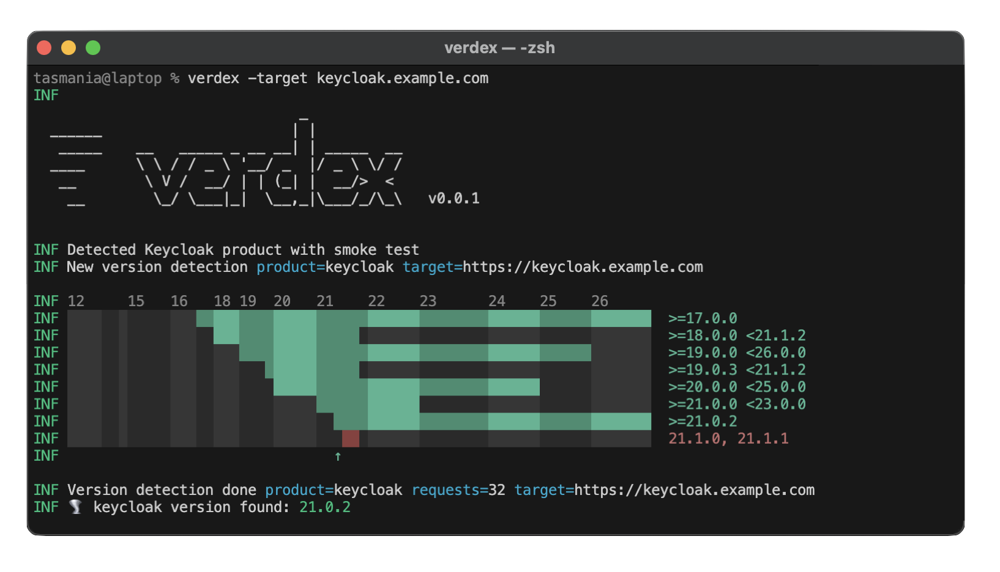

**Verdex** is a fast, collaborative, and open-source tool designed to 
**detect online service versions through feature-based analysis**,
even when traditional versioning information is unavailable. 
Verdex also **determines the accurate vulnerabilities** associated with the detected versions.

🌪️ Instead of relying on exposed headers, Verdex quickly analyzes the features present on a service. 
For example, **if a feature was introduced in a specific version, Verdex uses this information to deduce the 
minimum version of the service** (see [How It Works](https://docs.verdexlab.io/how-it-works) for more information).

🪶 Verdex relies solely on **non-aggressive methods**, in particular by using mostly static assets (javascript, css and html files).

🎯 Currently, Verdex supports detecting versions of **Keycloak**, **NextCloud**, **Rocket.Chat** and **Mastodon** (see [Products](https://docs.verdexlab.io/essentials/products) documentation).

⚠️ Any unauthorized use of Verdex to analyze or exploit online services is strictly prohibited and violates both our license agreement and applicable laws. **Verdex must be used with explicit authorization from the owner or administrator of the targets being scanned**.

## ⚡ Browser version

**An online version of Verdex is available at 
https://verdexlab.io**

This version is still in beta, don't hesitate to let us know if you encounter any problems!

## 📖 Documentation
The entire tool documentation is available at [https://docs.verdexlab.io](https://docs.verdexlab.io)

## 🚀 Install Verdex

Using Go:
```bash
go install -v github.com/verdexlab/verdex@latest
```

or using Docker:
```bash
echo 'alias verdex="docker run --rm verdexlab/verdex:latest"' >> ~/.bashrc
source ~/.bashrc
```

> 📖 Read documentation for more installation options: 
[https://docs.verdexlab.io/quickstart](https://docs.verdexlab.io/quickstart)

## 🌪️ Run version detection

```bash
verdex -target https://keycloak.example.com -output-json ./results.json
```

> 📖 Read documentation for more detection options: 
[https://docs.verdexlab.io/essentials/options](https://docs.verdexlab.io/essentials/options)

## License
Verdex is distributed under MIT License.
